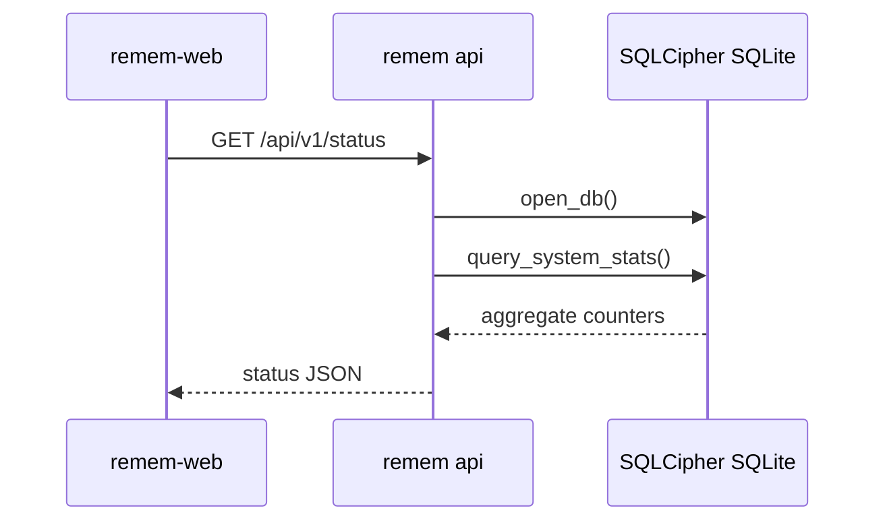
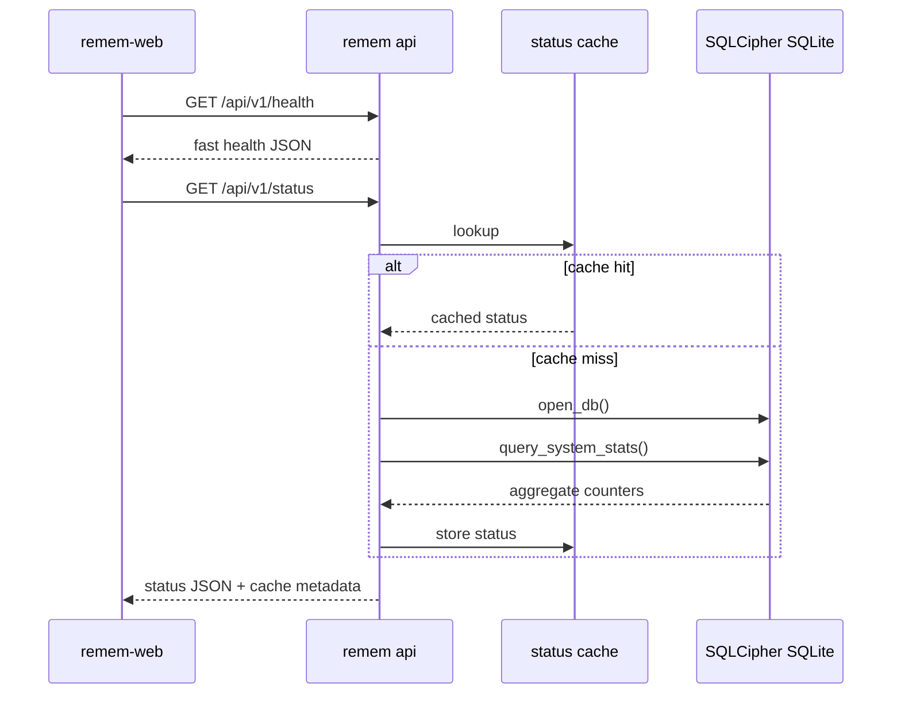

# Spec: Fast Health and Cached Status API

**Status**: Proposed
**Created**: 2026-06-20
**Last Updated**: 2026-06-20
**Owner**: remem core
**Tracking Issue**: [#588](https://github.com/majiayu000/remem/issues/588)

## Problem

`GET /api/v1/status` is currently used by local web clients as a liveness check and
as a status dashboard data source. Those are different jobs with different latency
budgets.

Observed on a local installed `remem 0.5.65` runtime with a roughly 1.1 GB
SQLCipher SQLite database:

| Probe | Result |
| --- | --- |
| `GET /api/v1/status`, first request | about 496 ms |
| `GET /api/v1/status`, warm requests | about 214-236 ms |
| TCP connect to `127.0.0.1:5567` | about 0.3 ms |
| `remem status --json`, warm CLI runs | about 0.53-0.54 s |
| `GET /api/v1/search?query=remem&limit=1`, warm requests | about 108-111 ms |
| `GET /api/v1/search?query=*&limit=1`, warm requests | about 285-294 ms |

The HTTP path is not the bottleneck. The likely cost is server-side DB open plus
the shared `query_system_stats` aggregate queries that count memories,
observations, captured events, extraction tasks, pending candidates, pending
observations, jobs, worker heartbeat, and related status fields.

For a web UI, this makes sidebar badges and online checks more expensive than
they should be. It also encourages clients to poll an aggregate endpoint when
they only need to know whether the local API is alive and which capabilities are
available.

## Goals

1. Add a fast, low-variance HTTP liveness endpoint for local clients.
2. Keep `/api/v1/status` useful for system status without requiring clients to
   poll heavy DB aggregates frequently.
3. Preserve the existing `/api/v1/status` contract unless a new versioned shape
   is explicitly introduced.
4. Give web clients a documented polling policy.
5. Add tests and smoke coverage so performance regressions are visible.

## Non-Goals

- Do not remove or rename `/api/v1/status`.
- Do not change memory search ranking, candidate review semantics, graph
  extraction, or the capture worker.
- Do not expose SQLCipher database access to web clients.
- Do not add a metrics daemon, Prometheus server, or always-on background
  service as a requirement.
- Do not silently hide DB errors from diagnostic endpoints.

## Current Flow



This is correct for a diagnostic panel, but too heavy for a liveness probe or
sidebar heartbeat.

## Proposed Design

Split the API into three explicitly different tiers.

### 1. Fast Health

Add:

```http
GET /api/v1/health
```

Response:

```json
{
  "ok": true,
  "version": "0.5.x",
  "api_version": 1,
  "schema_version": 41
}
```

Requirements:

- Require the same bearer token as other API endpoints.
- Bind only to localhost, same as the rest of the API.
- Avoid heavy aggregate queries.
- Prefer no DB open if version and API readiness can be derived without DB.
- If schema version requires DB access, do only the minimum read needed for the
  schema metadata, not `query_system_stats`.
- Never return token values or filesystem secrets.

### 2. Cached System Status

Keep:

```http
GET /api/v1/status
```

but serve it through a short in-process cache.

Recommended defaults:

| Field | Default |
| --- | --- |
| Cache TTL | 2 seconds |
| Max stale on refresh failure | 10 seconds |
| Cache scope | Process-local, per running `remem api` |
| Force refresh | `GET /api/v1/status?refresh=true` |

Behavior:

- First request computes the current status.
- Requests within TTL return the cached payload.
- `refresh=true` bypasses the cache for manual diagnostics.
- If refresh fails and a stale payload exists within the max-stale window,
  return the stale payload with `cache.stale=true` and include a structured
  warning field.
- If refresh fails and no acceptable stale payload exists, return the existing
  structured error response.

Add metadata:

```json
{
  "cache": {
    "hit": true,
    "stale": false,
    "generated_at_epoch": 1781940000,
    "ttl_secs": 2
  }
}
```

The cache metadata should be additive so older clients can ignore it.

### 3. Heavy Diagnostics

Keep heavy operational views explicit:

```http
GET /api/v1/status?refresh=true
GET /api/v1/stats
remem status --json
remem doctor
```

`/api/v1/stats` and CLI status can remain aggregate-heavy because users do not
need to poll them as liveness checks. Documentation should state that web
clients should use `/health` or `/capabilities` for liveness and feature
detection, and should not poll `/status` more frequently than the cache TTL.

## Target Flow



## API Contract

### `GET /api/v1/health`

Success:

```json
{
  "ok": true,
  "version": "0.5.110",
  "api_version": 1,
  "schema_version": 41
}
```

Error:

```json
{
  "error": {
    "code": "health_failed",
    "message": "schema metadata unavailable"
  }
}
```

If the implementation can avoid DB access, health should only fail for process
or auth-level issues. If it reads schema metadata, DB open failures should use a
specific structured error.

### `GET /api/v1/status`

Existing fields remain. Add optional cache metadata:

```json
{
  "version": "0.5.110",
  "memories": 71894,
  "observations": 6829,
  "captured_events": 2191,
  "pending_extraction_tasks": 1,
  "pending_memory_candidates": 1450,
  "pending_graph_candidates": 0,
  "cache": {
    "hit": false,
    "stale": false,
    "generated_at_epoch": 1781940000,
    "ttl_secs": 2
  }
}
```

`refresh=true`:

```http
GET /api/v1/status?refresh=true
```

forces recomputation and returns `cache.hit=false`.

## Alternatives Considered

### Option A: Add `/health` and cache `/status` (Recommended)

**Pros**

- Gives clients a true fast liveness endpoint.
- Reduces DB aggregate pressure from web sidebars and polling.
- Preserves `/status` compatibility.
- Keeps diagnostics truthful because forced refresh remains available.

**Cons**

- Adds one endpoint and a small cache invalidation surface.
- Status can be up to a few seconds stale by default.

**Decision**: Recommended. It separates client intents cleanly with limited
implementation risk.

### Option B: Only cache `/status`

**Pros**

- Smaller API surface.
- Faster repeated status calls.

**Cons**

- Clients still lack a clearly documented heartbeat endpoint.
- First status call remains heavy.
- UI authors may continue using `/status` for liveness and feature detection.

**Decision**: Rejected as incomplete. It improves repeated calls but does not
fix the contract ambiguity.

### Option C: Split `/status` into `basic` and `full` modes

Example:

```http
GET /api/v1/status?level=basic
GET /api/v1/status?level=full
```

**Pros**

- No new top-level endpoint.
- Can share response shape.

**Cons**

- Existing clients calling `/status` still get the old heavy default.
- Query flags are easier to misuse than a dedicated endpoint.
- It blurs health and diagnostics in one route.

**Decision**: Rejected for v1. It can be added later if needed, but `/health`
is clearer.

### Option D: Maintain a persisted status snapshot table

**Pros**

- Very fast reads.
- Can serve status even when some aggregate queries are expensive.

**Cons**

- Requires write-side updates from worker, capture, candidate review, and
  migration paths.
- Adds drift risk between source tables and snapshot counters.
- Larger correctness burden than a short in-process cache.

**Decision**: Defer. Use only if in-process caching and indexing do not meet
latency targets.

## Success Metrics

| Metric | Current | Target | Measurement |
| --- | --- | --- | --- |
| `/api/v1/health` warm p95 latency | Not available | < 25 ms | Local smoke loop against `remem api` |
| `/api/v1/status` warm cache-hit p95 latency | about 214-236 ms observed | < 50 ms | Local smoke loop with repeated requests |
| `/api/v1/status?refresh=true` p95 latency | about 214-236 ms observed | No regression over current | Local smoke loop |
| Status cache correctness | Not available | Cached payload age <= configured TTL unless marked stale | Handler tests |
| Auth behavior | Token required today | Same token requirement for health/status | Handler tests |
| Web polling load | Sidebar can call `/status` on navigation | Web uses `/health` or cached status; no sub-TTL polling | remem-web integration review |

## Implementation Plan

### Phase 1: Health Endpoint

- Add `HealthResponse` type.
- Add `handle_health`.
- Route `GET /api/v1/health` through the same auth middleware.
- Add `/health` to `/api/v1/capabilities.endpoints`.
- Add README API table entry.
- Add handler tests:
  - auth required
  - success payload includes version and api_version
  - token value is never returned

### Phase 2: Status Cache

- Add process-local status cache owned by API state, not a global mutable value.
- Store the serialized status payload plus `generated_at_epoch`.
- Add `StatusParams { refresh: Option<bool> }`.
- Cache only successful status payloads.
- Add `cache` metadata to the JSON response.
- Add handler tests:
  - first call computes
  - second call within TTL is a hit
  - `refresh=true` bypasses cache
  - refresh failure can serve allowed stale payload
  - refresh failure without stale payload returns structured error

### Phase 3: Docs and Smoke

- Document client guidance:
  - use `/health` for liveness
  - use `/capabilities` for feature detection
  - use `/status` for dashboard counters
  - do not poll `/status` faster than the TTL
- Add local smoke script coverage:
  - `/health`
  - `/capabilities`
  - repeated `/status`
  - `/status?refresh=true`
- Record latency output without printing the API token.

### Phase 4: Optional Query Profiling

- Add a developer-only profiling mode or test helper for `query_system_stats`.
- Use `EXPLAIN QUERY PLAN` for the slowest count queries.
- Add missing indexes only after evidence from a real DB or representative
  fixture.

## Risks and Mitigations

| Risk | Severity | Likelihood | Mitigation |
| --- | --- | --- | --- |
| Cached status hides a fresh DB failure | Medium | Medium | Cache only success, mark stale responses, bound max stale, keep `refresh=true` |
| Cache introduces shared mutable state bugs | Medium | Medium | Put cache inside API state with tests; keep payload immutable once stored |
| `/health` becomes another heavy endpoint | Medium | Low | Contract explicitly forbids aggregate queries; add tests and code review checklist |
| Clients misuse `/health` as feature detection | Low | Medium | Document `/capabilities` as feature detection endpoint |
| Performance targets are flaky on slow machines | Medium | Medium | Use smoke thresholds as guidance and unit-test cache behavior deterministically |
| Schema version lookup still opens SQLCipher DB | Low | Medium | Allow `schema_version` to be omitted or null if avoiding DB is required for fast health |

## Security and Privacy

- All new endpoints require the same bearer token as current API routes.
- Do not print, return, or log token values.
- Do not expose filesystem paths in `/health`.
- `/status` may continue returning operational counters; no new sensitive data
  should be added.
- Cache is process-local and in-memory only.

## Test Plan

Required before implementation PR completion:

```bash
cargo fmt --check
cargo check
cargo test health
cargo test status_cache
cargo test router_serves_capabilities_with_auth
cargo test
```

Required local smoke:

```bash
remem api --port 5567
TOKEN=$(cat ~/.remem/.api-token)
/usr/bin/curl -fsS -H "Authorization: Bearer $TOKEN" http://127.0.0.1:5567/api/v1/health
/usr/bin/curl -fsS -H "Authorization: Bearer $TOKEN" http://127.0.0.1:5567/api/v1/status
/usr/bin/curl -fsS -H "Authorization: Bearer $TOKEN" "http://127.0.0.1:5567/api/v1/status?refresh=true"
```

Latency smoke should use `curl -w` or an equivalent HTTP client and must not
print the token.

## Acceptance Criteria

- `GET /api/v1/health` exists, is authenticated, and returns stable JSON.
- `/api/v1/capabilities` advertises the health endpoint.
- `/api/v1/status` preserves existing fields and adds optional cache metadata.
- `/api/v1/status?refresh=true` recomputes status.
- Repeated `/api/v1/status` requests within the TTL are served from cache.
- Handler tests cover auth, cache hit, refresh, stale fallback, and structured
  error behavior.
- README documents the liveness/status/stats distinction.
- A smoke script or documented command verifies health and repeated status calls
  under bearer-token auth.
- remem-web can stop treating `/status` as a heartbeat and can use `/health` or
  `/capabilities` instead.

## Open Questions

1. Should `schema_version` be required in `/health` if reading it opens the DB?
   Recommendation: allow `schema_version: null` or omit it to keep health fast.
2. Should cache TTL be fixed or configurable?
   Recommendation: fixed 2 seconds first; add env/config only if real users need
   tuning.
3. Should stale status responses use HTTP 200 with `cache.stale=true`, or a
   warning status code?
   Recommendation: HTTP 200 only inside a short max-stale window, because the
   payload is still explicitly marked stale.
4. Should CLI `remem status --json` use the same cache?
   Recommendation: no. CLI status should remain a fresh diagnostic unless a
   future `--cached` flag is added.
