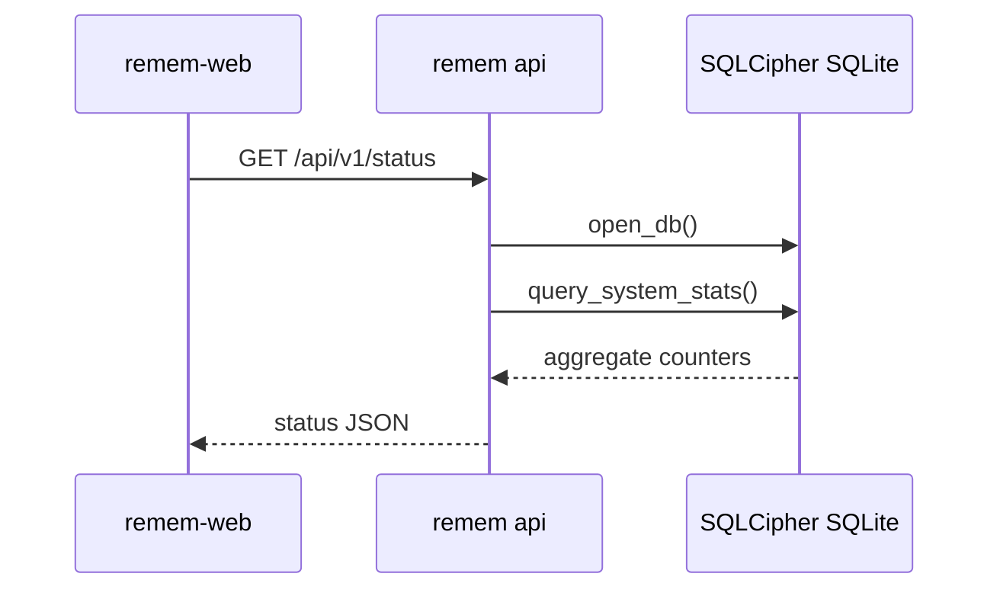
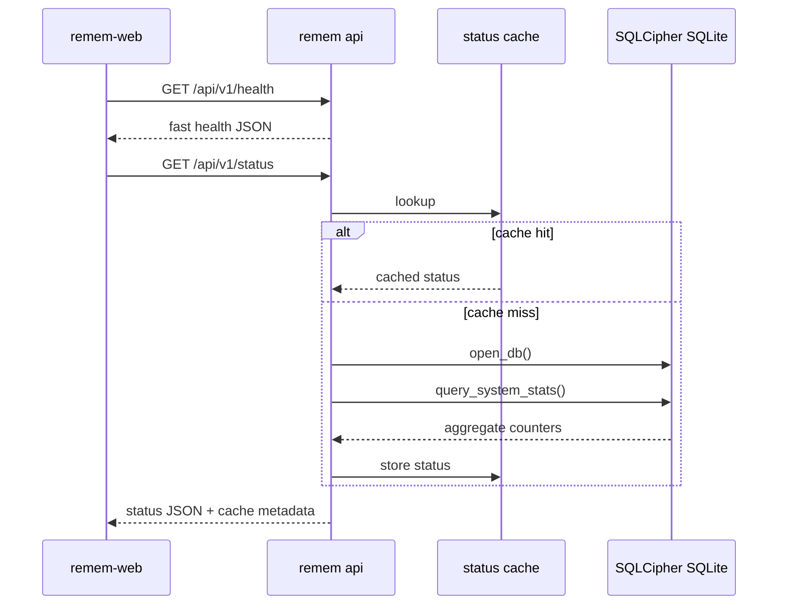

# Fast Health and Cached Status API Technical Spec

Status: Current contract
Date: 2026-06-20

Tracking:
- Fast health and cached status API: #588

## Existing Implementation Facts

- The API router is built in `src/api/server.rs`.
- `GET /api/v1/status` is handled by `src/api/handlers/status.rs`.
- The current status handler opens the request database and calls
  `db::query_system_stats`.
- `query_system_stats` lives in `src/db/query/stats.rs` and is shared with
  status-style diagnostics.
- `GET /api/v1/capabilities` is handled by
  `src/api/handlers/capabilities.rs`; its endpoint map currently advertises
  status, stats, search, memory, candidate, and graph routes.
- `tests/api_public.rs` and `src/api/tests.rs` cover the public API and router
  auth behavior.
- `docs/specs/SPEC-web-api.md` remains the current web API contract and must be
  updated by the implementation PR when the new endpoint ships.

## API Contract

### `GET /api/v1/health`

Success:

```json
{
  "ok": true,
  "version": "0.5.110",
  "api_version": 1,
  "schema_version": 41
}
```

If avoiding database access is required to keep health fast,
`schema_version` may be `null` or omitted. The implementation must choose one
stable shape and document it in `docs/specs/SPEC-web-api.md`.

Failure:

```json
{
  "error": {
    "code": "health_failed",
    "message": "schema metadata unavailable"
  }
}
```

Health should only fail for auth/process-level failures or for a specific
metadata read failure if the implementation reads schema metadata.

### `GET /api/v1/status`

Existing fields remain. Add optional cache metadata:

```json
{
  "version": "0.5.110",
  "memories": 71894,
  "observations": 6829,
  "captured_events": 2191,
  "pending_extraction_tasks": 1,
  "pending_memory_candidates": 1450,
  "pending_graph_candidates": 0,
  "cache": {
    "hit": false,
    "stale": false,
    "generated_at_epoch": 1781940000,
    "ttl_secs": 2
  }
}
```

`GET /api/v1/status?refresh=true` bypasses the cache, recomputes status, and
returns `cache.hit=false`.

## Router And Handler Plan

1. Add a health response type in `src/api/types.rs` or return a typed JSON value
   from a focused handler.
2. Add `src/api/handlers/health.rs` with `handle_health`.
3. Export the handler from `src/api/handlers.rs`.
4. Add `.route("/api/v1/health", get(handle_health))` in `src/api/server.rs`.
5. Keep the existing `route_layer(middleware::from_fn(require_api_token))` so
   health uses the same bearer-token auth as every other v1 endpoint.
6. Add `health: true` or equivalent capability support to the capabilities
   response.
7. Add `("health", "/api/v1/health")` to the capabilities endpoint map.

`handle_health` must not call `db::query_system_stats`. If it needs schema
metadata, it should read the smallest metadata source available.

## Status Cache Plan

Add process-local cache state owned by the API state, not a global mutable
singleton.

The cache entry should store:

| Field | Purpose |
| --- | --- |
| serialized status payload or typed status response | The last successful status result. |
| `generated_at_epoch` | Payload creation time for response metadata. |
| `ttl_secs` | Cache hit window, initially 2 seconds. |
| max-stale deadline | Maximum window for serving stale status after refresh failure, initially 10 seconds. |

Behavior:

1. First request computes the current status and caches only a successful
   payload.
2. Requests within TTL return the cached payload with `cache.hit=true`.
3. `refresh=true` bypasses the cache and recomputes.
4. If recompute fails and a stale payload exists inside the max-stale window,
   return the stale payload with `cache.stale=true` and a structured warning.
5. If recompute fails and no acceptable stale payload exists, return the
   existing structured status error.

The cache must not silently degrade diagnostic truth. Any stale response must be
machine-visible in the JSON payload.

## Current And Target Flow

Current:



Target:



## Tests

Required focused tests:

- `/api/v1/health` requires auth.
- `/api/v1/health` success includes version and `api_version`.
- `/api/v1/health` never returns token values or filesystem paths.
- `/api/v1/capabilities` advertises `/api/v1/health`.
- First `/api/v1/status` call computes status and reports `cache.hit=false`.
- Second `/api/v1/status` call inside TTL reports `cache.hit=true`.
- `/api/v1/status?refresh=true` bypasses cache.
- Refresh failure can serve a bounded stale payload with `cache.stale=true`.
- Refresh failure without an acceptable stale payload returns a structured
  error.

Recommended commands for the implementation PR:

```bash
cargo fmt --check
cargo check
cargo test health
cargo test status_cache
cargo test router_serves_capabilities_with_auth
cargo test
```

Required local smoke:

```bash
remem api --port 5567
TOKEN=$(cat ~/.remem/.api-token)
/usr/bin/curl -fsS -H "Authorization: Bearer $TOKEN" http://127.0.0.1:5567/api/v1/health
/usr/bin/curl -fsS -H "Authorization: Bearer $TOKEN" http://127.0.0.1:5567/api/v1/status
/usr/bin/curl -fsS -H "Authorization: Bearer $TOKEN" "http://127.0.0.1:5567/api/v1/status?refresh=true"
```

Latency smoke should use `curl -w` or an equivalent HTTP client and must not
print the token.

## Implementation Notes

- Cache successful payloads only.
- Use a deterministic clock abstraction or injectable time helper in tests if
  needed to avoid slow sleeps.
- Keep the status response additive so older clients can ignore `cache`.
- Do not move heavy aggregate behavior into `/health`.
- Keep CLI `remem status --json` fresh unless a future explicit `--cached` flag
  is added.
